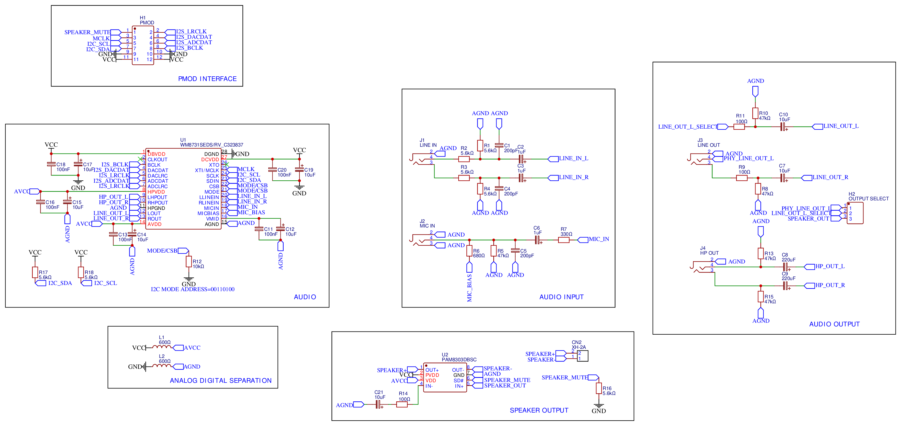
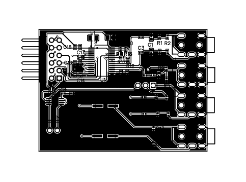

# WM8731PMOD

A small board to extend audio capabilities to FPGA via PMOD interface. Designed with [lceda](https://lceda.cn)。

It includes:

1. [WM8731](https://www.cirrus.com/products/wm8731/) chip with I2C and I2S
2. [PAM8303](https://m5stack.oss-cn-shenzhen.aliyuncs.com/resource/docs/datasheet/hat/PAM8303_en.pdf) + XH2.54 2P for speaker output
3. 4x TRS port for line in, mic in, line out and headphone out
4. [PMOD](https://reference.digilentinc.com/_media/reference/pmod/pmod-interface-specification-1_2_0.pdf) connection to FPGA

## PMOD pin definition

| Description  | Pin number | Pin number | Description |
| ------------ | ---------- | ---------- | ----------- |
| SPEAKER_MUTE | 7          | 1          | I2S_LRCLK   |
| MCLK         | 8          | 2          | I2S_DACDAT  |
| I2C_SCL      | 9          | 3          | I2S_ADCDAT  |
| I2C_SDA      | 10         | 4          | I2S_BCLK    |
| GND          | 11         | 5          | GND         |
| VCC          | 12         | 6          | VCC         |

## Project

Online version is available at [oshwhub.com/jiegec/wm8731mod](https://oshwhub.com/jiegec/wm7831pmod)。

Schematic, PCB, Gerber and BOM files are included in this repo.

## Errata

### #1: PMOD interface flipped

Version affected: 2021-03-07, 2021-03-09

PMOD interface is flipped in direction, so you need to flip the board to match the correct pin mapping.

## Cost

Manufacture in JLC:

1. 5 pcs PCB: 5.0 CNY + tax 0.4 CNY
2. 5 pcs SMT: Components 126.18 CNY(WM8731 16.05 CNY/pcs, PAM8303 2.51 CNY/pcs) + Other fees 154.4 CNY(Extended library 60 CNY, Engineering 50 CNY, SMT pad 5.9 CNY, Hand weld pad 18.5 CNY, Hand engineering 20 CNY) + Tax 22.45 CNY

Total: 61.686 CNY/pcs.

## References

- [A similar project](http://ebrombaugh.studionebula.com/synth/codec_pmod/index.html)
- [DE2 board schematic](https://wiki.bu.ost.ch/infoportal/_media/fpga/cyclone_iv/de2_115_schematic.pdf)

## Version history

## 2021-04-29

1. Fixed typo: WM7831 -> WM8731

## 2021-04-13

1. Fixed errata #1: PMOD interface flipped

## 2021-03-09

1. Add support for speaker: XH2.54P connector and PM8303 amplifiier
2. Add output selector to choose one of: speaker and line out left

# 2021-03-07

1. Initial version with WM8731 and four audio jacks

## License

Licensed under CERN-OHL-P.